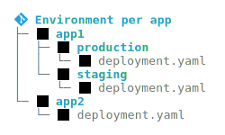

cloudogu/gitops-patterns
===

## Intro
This repo collects some patterns (AKA strategies, models, approaches, best practices, etc.) about
GitOps process design (AKA GitOps repository structures, etc.) as well as links to talks, articles and example repos.

It originated in [schnatterer's talk](https://cloudogu.github.io/gitops-talks/2023-03-mastering-gitops/#/)
about the "perfect" GitOps process, our experience in [consulting](https://cloudogu.com/en/consulting/?mtm_campaign=gitops-playground&mtm_kwd=consulting&mtm_source=github&mtm_medium=link),
and our [GitOps trainings for both Flux and ArgoCD](https://platform.cloudogu.com/en/trainings/gitops-continuous-operations/?mtm_campaign=gitops-playground&mtm_kwd=training&mtm_source=github&mtm_medium=link).

You can read more about the patterns in [this series of articles](#articles).

PRs welcome!

## Contents

- [Articles](#articles)
- [Pattern categories](#pattern-categories)
- [GitOps Patterns](#gitops-patterns)
  - [Operator deployment](#operator-deployment)
    - [Hub and Spoke](#hub-and-spoke)
    - [Instance per Cluster](#instance-per-cluster)
    - [Instance per Namspace](#instance-per-namespace)
    - [Split-Instance](#split-instance)
  - [Repository structure](#repository-structure)
    - [Monorepo](#monorepo)
    - [Repo per Team](#repo-per-team)
    - [Repo per Application](#repo-per-app) (can be implemented via [Repo Separation](#repo-separation), [Config Replication](#config-replication), [Repo Pointer](#repo-pointer) or [Config Split](#config-split))
    - [Repo per Environment](#repo-per-env)
  - [Promotion](#promotion)
    - [Environments](#environments)
      - [Folder/Directory per environment](#folder-per-env)
      - [Repo per environment](#repo-per-env)
      - [Branch per environment](#branch-per-env)
      - [Preview environments](#preview-env)
    - [Implementation](#implementation)
      - [Configuration Management](#config-management), includes [Rendered Manifests](#rendered-manifests) and [Umbrella Chart](#umbrella-chart)
      - [Global Environments vs Environment per App](#global-vs-env-per-app)
      - [Config update](#config-update)
  - [Wiring](#wiring)
    - [Bootstrapping](#bootstrapping)
    - [Linking](#linking), includes [Nesting](#nesting) (e.g. [App of Apps](#app-of-apps)), [Templating](#templating)
- [Public GitOps Repo Examples](#public-gitops-repo-examples)
  - [GitOps Playground](#gitops-playground)
  - [ArgoCD autopilot](#argocd-autopilot)
  - [Flux Monorepo](#flux-monorepo)
  - [Flux repo per team/tenant](#flux-repo-per-teamtenant)
  - [📕 Path to GitOps examples](#-path-to-gitops-examples)
  - [Environment variations](#environment-variations)
  - [Others](#others)
- [Synonyms](#synonyms)
- [References](#references)

## Articles

<table border="0">
   <tr>
     <td></td>
     <td><a href="https://cloudogu.com/en/blog/gitops-repository-patterns-part-1-introduction">Part 1️⃣: GitOps Chasm + categories</a></td>
  </tr>
  <tr>
     <td></td>
     <td><a href="https://cloudogu.com/en/blog/gitops-repository-patterns-part-2-operator-deployment-patterns">Part 2️⃣: Deployment patterns</a></td>
  </tr>
  <tr>
     <td></td>
     <td><a href="https://cloudogu.com/en/blog/gitops-repository-patterns-part-3-repository-patterns">Part 3️⃣: Repo patterns</a></td>
  </tr>
  <tr>
    <td></td>
    <td><a href="https://cloudogu.com/en/blog/gitops-repository-patterns-part-4-promotion-patterns">Part 4️⃣: Promotion patterns</a></td>
  </tr>
  <tr>
    <td></td>
    <td><a href="https://cloudogu.com/en/blog/gitops-repository-patterns-part-5-wiring-patterns">Part 5️⃣: Wiring patterns + conclusion</a></td>
  </tr>
  <tr>
    <td></td>
    <td><a href="https://cloudogu.com/en/blog/gitops-repository-patterns-part-6-examples">Part 6️⃣: Example Repositories</a></td>
  </tr>
</table>

## Pattern categories

Let's group GitOps patterns into separate categories to make them easier to grasp.  
See also [part 1️⃣ of the article series](https://cloudogu.com/en/blog/gitops-repository-patterns-part-1-introduction).

* **Operator deployment**: GitOps operators ↔ Clusters/Namespaces
* **Repository**: How many repos?
* **Promotion**: 
  * Environments: How to model environments/stages?
  * Implementation: How to implement the actual process of promotion?
* **Wiring**: Bootstrapping operator, linking repos and folders

## GitOps Patterns

### Operator deployment

See also [part 2️⃣ of the article series](https://cloudogu.com/en/blog/gitops-repository-patterns-part-2-operator-deployment-patterns).

* **Hub and Spoke** [^1][^2] 1 Operator : n Clusters      
  Synonyms: Management Cluster [^18] - sounds familiar, e.g. from Cluster API, but it requires a cluster. In SaaS/PaaS constellations, the central instance may not even be operated in a cluster. Therefore, the term "Hub and Spoke" seems more fitting to us, especially since it is also well known from computer networks or logistics.  
  
* **Instance Per Cluster** [^18] : 1 Operator : 1 Cluster    
  Synonyms: Standalone [^1] - could apply to both "Instance per Cluster" and "Instance per Namespace"; does not define the relationship to clusters and namespaces precisely enough, as not every operator supports both deployment patterns.  
  
* **Instance per Namespace**: n Operators : 1 Cluster    
  Synonyms: Namespaced [^3]  
  

More Patterns:
* Split-Instance[^1]: 1 Operator : n Clusters; components split between management and target clusters
* Hybrids of Hub and Spoke and Instance per Cluster patterns: "Instance per Logical Group" and "Argo Managing more Argos".[^18]

### Repository structure

See also [part 3️⃣ of the article series](https://cloudogu.com/en/blog/gitops-repository-patterns-part-3-repository-patterns).

* **Monorepo** [^2][^4]   
  Opposite: polyrepo [^2]
* **Repo per Team** [^4]   
  More generalized: Team ➡️ Tenant[^4]
* **Repo per Application** [^2][^4]     
  Implementations:
  * Repo separation [^19]   
    Keep code in app repo, config in config repo   
    
  * Config replication [^3]   
    Keep config in app repo and have CI server replicate it to the config repo  
      
  * Repo pointer [^6][^3][^4]   
    Keep the whole config in app repo and add a pointer from config repo (e.g. Argo CD `Application` or a Flux `GitRepository`+`Kustomization`), avoiding redundancy   
    
  * Config Split [^20]   
    Keep parts of the config in app repo (e.g. helm chart or kustomize base), and rest in config repo (e.g. `value.yaml`s or overlays for different envs).  
    Then have the config repo point to the app repo (e.g. via ArgoCD `Application` or Flux `Kustomization`).  
      
    Alternative implementations: have CI server push chart to **helm registry**  
      
    Or use push **helm chart to OCI registry**  
      
    Or use any config management tool (e.g. `helm template`, `kustomize build`, `kubectl kustomize`, [jsonnet](https://jsonnet.org/), [cuelang](https://cuelang.org/), [timoni](https://timoni.sh/), etc. ) on the CI server for pushing the final manifests as **OCI artifacts[^22] to the registry** (Rendered Manifests Pattern[^23]).  
    Then have the config repo point to the OCI artifact (e.g. via Flux `Kustomization`).  
    This way, the OCI registry functions as a "GitOps Cache"[^21]:  
    The operator only needs to pull the artifacts instead of rendering/overlaying the config from different sources.   
    
* **Repo per environment** [^4]   
  Synonym: Environment per repository[^5], Repo per Stage

### Promotion

See also [part 4️⃣ of the article series](https://cloudogu.com/en/blog/gitops-repository-patterns-part-4-promotion-patterns).

We understand the term "promotion" as the process of deploying applications to different environments.  
Sometimes, the term "promotion" is prefixed with other words: [Release](https://codefresh.io/blog/how-to-model-your-gitops-environments-and-promote-releases-between-them/)/[Application](https://kubernetes.io/docs/tutorials/kubernetes-basics/update/update-intro)/[Environment](https://github.com/kostis-codefresh/gitops-environment-promotion)/[Workload](https://www.weave.works/blog/kubernetes-workload-promotion-in-gitops-cd-pipelines)/[Change](https://twitter.com/argoproj/status/1642527308450873345).

For promotion, we see different sets of patterns: 
* one regarding the modelling of environments and
* one regarding the implementation of the actual process of promotion.

#### Environments

* **Folder/Directory per environment**   
  Synonym: Environment per folder [^5]
* **Repo per environment** [^4]    
  Synonym: Environment per repo [^5]
* **Branch per environment**    
  Synonym: Environment per branch [^5]  
  Often discouraged [^6] or declared an anti-pattern[^7][^14], but can work [^13].
* **Preview environments** [^9] [^10] [^11]   
  Synonyms: ephemeral, dynamic, pull request[^8], test, temporary[^9]  
  Beyond the GitOps world also known as "Preview Deployments"[^15] and "Deploy Previews"[^16]

#### Implementation

* **Configuration Management**   
  * Synonyms:
    * General: Templating, Patching, Overlay, Rendering, Hydrating
    * templates = dry; rendered = hydrated [^26]
  * Where to render the manifests?
    * On the CI Server (**Rendered Manifests Pattern**[^23])   
      This pattern also fits nicely with Flux's OCI artifacts feature (see [Config split](#config-split)).
    * On the GitOps Operator (**GitOps Operator Rendering** or **GitOps Controller Rendering**[^25])
  * Tools: 
    * Kustomize
      * Plain`kustomization.yaml` - **operator-agnostic** (GitOps Operator Rendering on Argo CD and Flux)
      * ≠ Flux CRD `Kustomization` (GitOps Operator Rendering)
      * `kustomize build` / `kubectl kustomize` via CI server (Rendered Manifests)
    * Helm
      * CRD such as `HelmRelease` (GitOps Operator Rendering on Flux) or `Application` (GitOps Operator Rendering on ArgoCD)
      * Umbrella Chart[^12]  (common on Argo CD, possible but unusual on Flux)
      * `helm template` on CI server (Rendered Manifests)
    * Others, e.g. Jsonnet, CueLang, Timoni
      * Rendered Manifests Pattern
      * Argo CD Config Management Plugins[^24] (built-in for JSonnet)
* **Global Environments** vs **Environment per App**[^3]    
  
  
* **Config update**   
  Who updates image (version) in GitOps repo, creates branch and PR?
  * Manual: Human pushes branch and create PR 🥵
  * CI Server: Build job pushes branch, creates PR  
      
  * Image Updater: Operator pushes branch, create PR manually  
    
  * Dependency Bot: Bot pushes branch, creates PR  
    

### Wiring

See also [part 5️⃣ of the article series](https://cloudogu.com/en/blog/gitops-repository-patterns-part-5-wiring-patterns).

* **Bootstrapping** ,
  e.g. using `kubectl` or operator-specific CLI such as `flux` or `argocd-autopilot`
* **Linking** 
  e.g. using Operator-specific CRDs such as `Kustomization` (Flux) or `Application` (ArgoCD)
  * **Nesting**, e.g. App of Apps pattern [^17] (ArgoCD)  
  * **Templating**, e.g. implemented using `ApplicationSets` 

## Public GitOps Repo Examples

See also [^3].

See also [part 6️⃣ of the article series](https://cloudogu.com/de/blog/gitops-repository-patterns-part-6-examples).

The diagrams have been created with [tree2svg](https://github.com/schnatterer/tree2svg).

### GitOps Playground
[cloudogu/gitops-playground](https://github.com/cloudogu/gitops-playground)

* **Repo pattern**: Per team mixed with per app (implemented via Config Replication)
* **Operator pattern**: Instance per Cluster (Hub and Spoke also possible)
* **Operator**: ArgoCD (Flux)
* Boostrapping: `Helm`, `kubectl`
* Linking: ArgoCD `Application`
* **Features**:
  * Env per app Pattern
  * Operate ArgoCD with GitOps
  * Config Update via CI server
  * Mixed repo patterns
  * ArgoCD **and** Flux examples

### ArgoCD autopilot

[argoproj-labs/argocd-autopilot](https://github.com/argoproj-labs/argocd-autopilot)

* **Repo pattern**: Monorepo
* **Operator pattern**: Instance per Cluster / Hub and Spoke
* **Operator**: ArgoCD
* **Boostrapping**: `argocd-autopilot`
* Linking: `kustomization.yaml`, ArgoCD `Application`, `ApplicationSet`
* Features:
  * Operate ArgoCD with GitOps
  * In the future: a lot more automation
    and YAML creation

### Flux Monorepo

[fluxcd/flux2-kustomize-helm-example](https://github.com/fluxcd/flux2-kustomize-helm-example)

* **Repo pattern**: Monorepo
* **Operator pattern**: Instance per Cluster
* **Operator**: Flux
* **Boostrapping**: `flux` CLI
* **Linking**: `kustomization.yaml`, Flux `Kustomization`
* **Features**: cross-cutting infra

### Flux repo per team/tenant

[fluxcd/flux2-multi-tenancy](https://github.com/fluxcd/flux2-multi-tenancy)

* **Repo pattern**: Repo per team/tenant
* **Operator pattern**: Instance per Cluster
* **Operator**: Flux
* **Boostrapping**: `flux` CLI
* **Linking**: `kustomization.yaml`, Flux `Kustomization`
* **Features**: cross-cutting infra

### 📕 Path to GitOps examples

[christianh814/example-kubernetes-go-repo](https://github.com/christianh814/example-kubernetes-go-repo)

[christianh814/example-kubernetes-goflux-repo](https://github.com/christianh814/example-kubernetes-goflux-repo/)

[christianh814/example-openshift-go-repo](https://github.com/christianh814/example-openshift-go-repo)

* **Repo pattern**: Monorepo
* **Operator pattern**: Instance per Cluster
* **Operator**: [ArgoCD] [flux]
* **Boostrapping**: kubectl
* **Linking**: `kustomization.yaml`,
  * ArgoCD `Application`, `ApplicationSet` /
  * Flux  `Kustomization`
* **Features**:
  * Cross-cutting infra and app(s)
  * ArgoCD **and** Flux examples

### Environment variations

[kostis-codefresh/gitops-environment-promotion](https://github.com/kostis-codefresh/gitops-environment-promotion)

* Operator: ArgoCD  (Flux)
* Features:
  * Env variants for a single app
  * Promotion "via cp"

### Others

Here are some other examples that we haven't had a chance to look at in more detail:

* [Lp-Francois/argocd-multi-tenancy](https://github.com/Lp-Francois/argocd-multi-tenancy) 

## Synonyms

* Patterns ≈ strategies, models, approaches, best practices, standards
* GitOps process design ≈ GitOps repository structures,
* GitOps Operator ≈ GitOps controller ≈ GitOps agent
* Config Repo = GitOps repo, Infra repo, Payload repo  
  
* App repo = Source code repo, Source repo  
  
* Environment = Stage
* Folder = Directory
* Templating ≈ Patching, Overlay, Rendering, Bundling, Packaging?

## References

[^1]: Article [A Comprehensive Overview of Argo CD Architectures – 2023](https://codefresh.io/blog/a-comprehensive-overview-of-argo-cd-architectures-2023/) by Dan Garfield  
[^2]: Article/Book [How to set up your GitOps directory structure](https://developers.redhat.com/articles/2022/09/07/how-set-your-gitops-directory-structure) by Christian Hernandez  
[^3]: Slides [The perfect GitOps process: repos, folders, stages, patterns](https://cloudogu.github.io/gitops-talks/2023-03-mastering-gitops/#/) by Johannes Schnatterer  
[^4]: Documentation [Flux | Ways of structuring your repositories](https://github.com/fluxcd/website/blob/a426979/content/en/flux/guides/repository-structure.md#repo-per-app)  
[^5]: Lesson [GitOps at Scale Lesson series - Git repository strategies](https://learning.codefresh.io/path-player?courseid=gitops-scale&unit=gitops-scale_63a08184b7f67Unit) by Codefresh (paywalled)  
[^6]: Talk [GitOps: Core Concepts & Ways of Structuring Your Repos](https://www.youtube.com/watch?v=vLNZA_2Na_s) by Pinky Ravi and Scott Rigby  
[^7]: Article [Stop Using Branches for Deploying to Different GitOps Environments](https://codefresh.io/blog/how-to-model-your-gitops-environments-and-promote-releases-between-them/) by Kostis Kapelonis  
[^8]: Video [Environments Based On Pull Requests (PRs): Using Argo CD To Apply GitOps Principles On Previews](https://www.youtube.com/watch?v=cpAaI8p4R60) by Viktor Farcic  
[^9]: Article [Creating Temporary Preview Environments Based On Pull Requests With Argo CD And Codefresh](https://codefresh.io/blog/creating-temporary-preview-environments-based-pull-requests-argo-cd-codefresh/) by Codefresh  
[^10]: Talk [GitOps Con Europe - Implementing Preview Environments with GitOps in Kubernetes ](https://www.youtube.com/watch?v=QNAiIJRIVWA&t=202s) by  François Le Pape, Remazing  
[^11]: Talk [Preview Environments with ArgoCD](https://www.youtube.com/watch?v=7ahiwZuiCBM) by Brandon Phillips  
[^12]: Documentation [Helm | Chart Development Tips and Tricks](https://github.com/helm/helm-www/blob/d2543/content/en/docs/howto/charts_tips_and_tricks.md#complex-charts-with-many-dependencies)  
[^13]: Article [Monitoring and Hardening the GitOps Delivery Pipeline with Flux](https://medium.com/mediamarktsaturn-tech-blog/monitoring-and-hardening-the-gitops-delivery-pipeline-with-flux-a226bdef0351) by Florian Heubeck  
[^14]: Article [Git best practices: Workflows for GitOps deployments ](https://developers.redhat.com/articles/2022/07/20/git-workflows-best-practices-gitops-deployments) by Christian Hernandez  
[^15]: Documentation [Vercel: Preview Deployments](https://vercel.com/docs/concepts/deployments/preview-deployments)  
[^16]: Documentation [Netlify: Deploy Previews](https://docs.netlify.com/site-deploys/deploy-previews/)  
[^17]: Documentation [ArgoCD: Cluster Bootstrapping - App Of Apps Pattern](https://github.com/argoproj/argo-cd/blob/v2.9.3/docs/operator-manual/cluster-bootstrapping.md#app-of-apps-pattern)  
[^18]: Talk  [Control Plane, Service, or Both? – Argo CD Multi-Cluster Architectures - Nicholas Morey, Akuity](https://www.youtube.com/watch?v=vyaZv4yM3_o), Article [How many do you need? - Argo CD Architectures Explained](https://akuity.io/blog/argo-cd-architectures-explained/) by Nicholas Morey  
[^19]: Documentation [Argo CD: Best Practices](https://github.com/argoproj/argo-cd/blob/v2.8.4/docs/user-guide/best_practices.md#separating-config-vs-source-code-repositories)  
[^20]: [Discussion on LinkedIn](https://www.linkedin.com/feed/update/urn:li:activity:7121084907526713346?commentUrn=urn%3Ali%3Acomment%3A%28activity%3A7121084907526713346%2C7121143258256166912%29&dashCommentUrn=urn%3Ali%3Afsd_comment%3A%287121143258256166912%2Curn%3Ali%3Aactivity%3A7121084907526713346%29) Benjamin Ruland and Johannes Schnatterer  
[^21]: Talk: [Mastering GitOps 2023: Keynote: GitOps Emerging Developments and Predictions](https://vimeo.com/805175348) by Alexis Richardson  
[^22]: Documentation [Flux | OCI cheatsheet](https://github.com/fluxcd/website/blob/a426979/content/en/flux/cheatsheets/oci-artifacts.md)  
[^23]: Talk: [GitOpsCon EU 23: The Art of GitOps: Rendered Manifests](https://gitopsconeu2023.sched.com/event/1Unk5/the-art-of-gitops-rendered-manifests-christian-hernandez-akuity?iframe=yes&w=100%&sidebar=yes&bg=no) by Christian Hernandez  
[^24]: Documentation [Argo CD | Config Management Plugins](https://github.com/argoproj/argo-cd/blob/v2.9.3/docs/operator-manual/config-management-plugins.md)
[^25]: [Discussion on LinkedIn](https://www.linkedin.com/feed/update/urn:li:activity:7138481326424276992?commentUrn=urn%3Ali%3Acomment%3A%28activity%3A7138481326424276992%2C7138548943428194304%29&dashCommentUrn=urn%3Ali%3Afsd_comment%3A%287138548943428194304%2Curn%3Ali%3Aactivity%3A7138481326424276992%29)  Christian Hernandez, Scott Rigby and Johannes Schnatterer  
[^26]: [Discussion on GitHub](https://github.com/argoproj/argo-cd/pull/17506#discussion_r1525548738)  Michael Crenshaw 